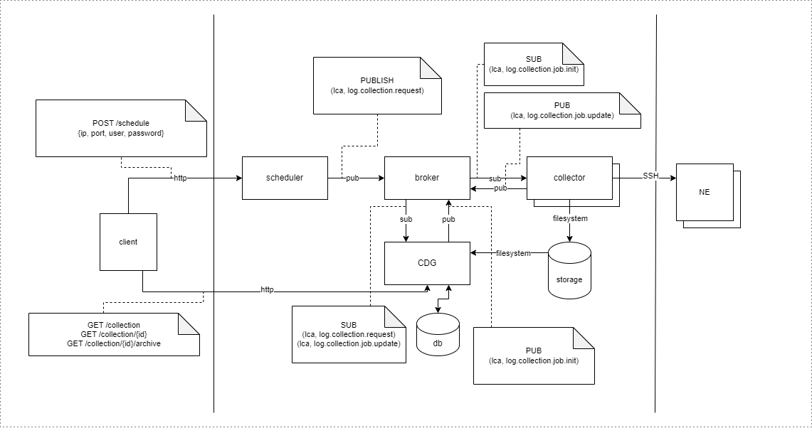

# Log Collection Aggregator

## Architecture



## Deployment

### Overview

Kubernetes configuration are grouped in folders corresponding to related services.

- `db` - postgres service with persistent storage
- `rabbitmq` - rabbitmq service with persistent storage
- `ne` - light ubuntu image with ssh (root:root)
- `services/cdg` - cfg service with configuration
- `services/scheduler` - scheduler service with configuration
- `services/collector` - collector service with configuration
- `services/web` - web service with configuration
- `services/front` - static frontend site

# Running on local cluster

**When cluster is not created with `minikube` verify `storageClassName` in all `*-pv.yaml` files.**

Deploying all configuration files in directory should start and configure every service automatically. Additionally setup is configured to create required databases for services.

1. Install envoy proxy gateway
```sh
kubectl apply -f https://github.com/envoyproxy/gateway/releases/download/v1.0.2/install.yaml
kubectl wait --timeout=5m -n envoy-gateway-system deployment/envoy-gateway --for=condition=Available
```

2. Build images
```sh
# in repository root directory run following:
docker build --pull --no-cache -f deployments/services/scheduler/Dockerfile -t lca-scheduler:latest .
docker build --pull --no-cache -f deployments/services/cdg/Dockerfile -t lca-cdg:latest .
docker build --pull --no-cache -f deployments/services/collector/Dockerfile -t lca-collector:latest .
docker build --pull --no-cache -f deployments/services/front/Dockerfile -t lca-front:latest .
docker build --pull --no-cache -f deployments/services/web/Dockerfile -t lca-web:latest .
docker build --pull --no-cache -f deployments/ne/Dockerfile -t lca-ne:latest .

# or using skaffold
skaffold build
```
3. Apply k8s configurations
```sh
kubectl apply -f deployments -R
```
4. Run port forward script `./port-forward.sh` 
5. Navigate to [app](http://lca.localhost:8080/)