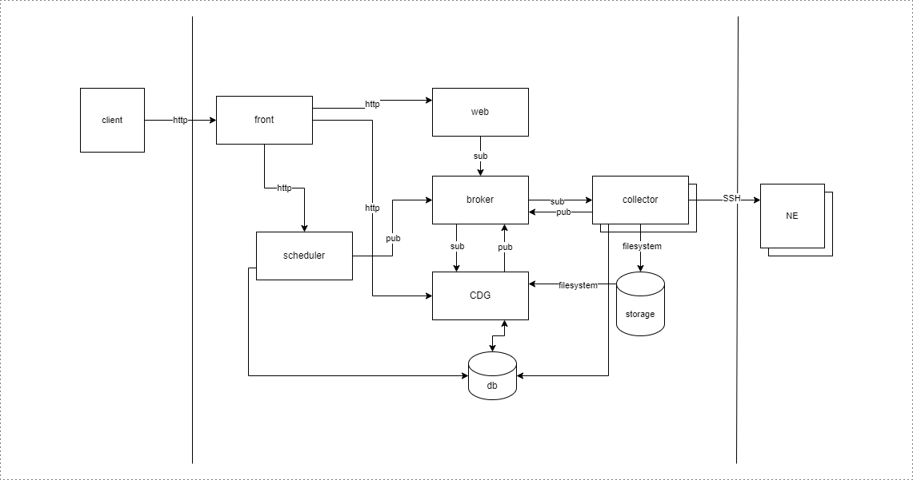

# Log Collection Aggregator

## Architecture

## Deployment

**When cluster is not created with `rancher desktop` verify `storageClassName` in all `*-pv.yaml` files.**

### Overview

Kubernetes configuration are grouped in folders corresponding to related services.

- `db` - postgres service with persistent storage
- `rabbitmq` - rabbitmq service with persistent storage
- `ne` - light ubuntu image with ssh (root:root)
- `services/cdg` - cfg service with configuration
- `services/scheduler` - scheduler service with configuration
- `services/collector` - collector service with configuration

**Each custom service folder contains `Dockerfile` make sure images are build (with latest tag) before local deployment**

Alternatively you can use [skaffold](https://skaffold.dev/docs/quickstart/)

Deploying all configuration files in directory should start and configure every service automatically. Additionally setup is configured to create required databases for services.

# Links

- [scheduler swagger ui](http://localhost:30010/api)
- [cfg swagger ui](http://localhost:30020/api)
- [collector swagger ui](http://localhost:30030/api)
- [RabbitMQ Management](http://localhost:31234/#/queues) (guest:guest)